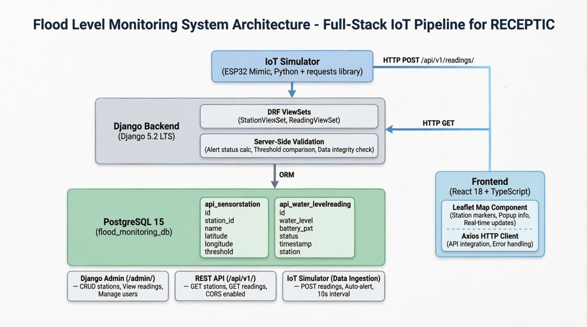

# Flood Level Monitoring API
**Full-Stack Demo for Eurac Research (RECEPTIC IoT Developer Role)**  
**Author:** Abdul Fikri | **Date:** March 2026  
**Contact:** afikri@cseas.kyoto-u.ac.jp | +81 70 8905 7097

*A complete IoT pipeline: ESP32-like sensor → Django REST API → PostgreSQL → Threshold Alerting → React + Leaflet Dashboard*

---

## Relevance to RECEPTIC Project

| RECEPTIC Requirement | This Demo | My CV Experience |
|---------------------|-----------|------------------|
| **Django Backend** | Django 5.2 LTS + DRF ViewSets | **MAHS (2024–Present):** Arches database management |
| **PostgreSQL** | Production-ready schema with indexes | **Aceh Green (2012):** Designed PostgreSQL databases for Aceh Government |
| **REST API Design** | Versioned `/api/v1/` endpoints | **UNICEF (2021):** Interoperable mechanisms with government systems |
| **IoT Data Ingestion** | Python simulator mimicking ESP32 | **BNPB (2023):** MHEWS SRS analysis & sensor requirements |
| **Geospatial Visualization** | React + Leaflet map dashboard | **UNICEF (2021):** SDG Dashboard development |
| **System Security** | CORS, server-side validation | **Better Work (2018):** Database security & unauthorized access prevention |

---

## Architecture Overview
